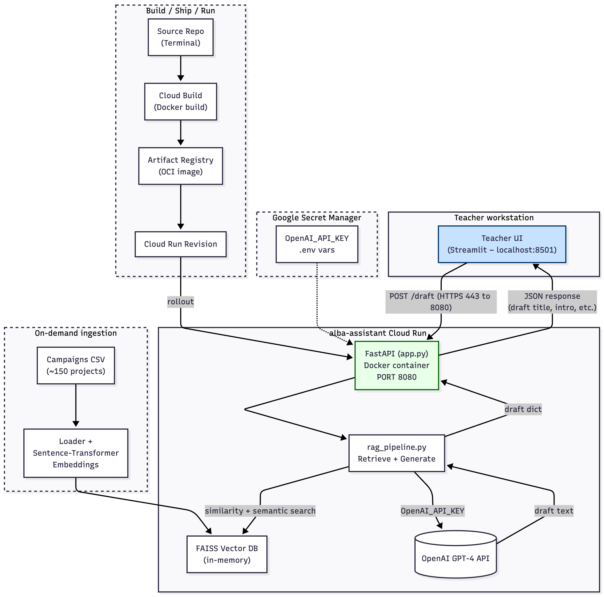

# 🎓 School Raising Assistant (MVP)

**Alba** is an AI-powered virtual assistant designed to help teachers and school project creators write compelling crowdfunding campaigns in just a few minutes, based on a few simple inputs.

## 🚀 Objective

Build a functional MVP (internal demo) in 3 weeks that:
- Transforms 5 user inputs into a campaign draft
- Suggests title, in practice ( one sentence to describe the project), introdution, description and rewards
- Is inspired by ~150 past school campaigns
- Uses a hosted LLM (OpenAI GPT-4o) and lightweight RAG pipeline

## 🧰 Tech Stack

- Python 3.12.4
- FastAPI
- RAG 
- Embeddigs
- FAISS vector DB
- OpenAI API (GPT-4o)
- Streamlit

# 🧪 How to Run the School Raising Assistant (Local Only)

This guide walks you through setting up and running the assistant locally via CLI.

---

## 1. 📥 Clone the Repository

```bash
git clone https://github.com/your-username/school-raising-assistant.git
cd school-raising-assistant
```

---

## 2. 🐍 Create & Activate Virtual Environment

```bash
python -m venv .venv
source .venv/bin/activate     # On Windows: .venv\Scripts\activate
```

---

## 3. 📦 Install Dependencies

```bash
pip install --no-cache-dir -r requirements.txt
```

---

## 4. 🔐 Set Environment Variables

Create a `.env` file in the root directory with your OpenAI API key ( at the moment there are my keys):

```env

ALBA_API_BASE=https://alba-assistant-api-712522077513.europe-west1.run.app
```

---

## 5. 🤖 Run the Assistant in CLI Mode (local test)

```bash
python -m pipeline.generate_embeddings #in order to generate your embeddings 
python interactive_assistant.py
```

This will launch the assistant in your terminal. You’ll be guided through 5 input questions and get a full campaign draft in response.

# How to run the School Raising assistant via Streamlit

Please follow those step in order to use Alba and generate a campaign via the front end Streamil

## 1. 🐍 Create & Activate Virtual Environment

```bash
python -m venv .venv
source .venv/bin/activate     # On Windows: .venv\Scripts\activate
```
## 2. 📦 Install Dependencies

```bash
pip install --no-cache-dir -r requirements.ui.txt # be sure you are in the front_end folder
```

## 3. Run Streamlit

```bash
streamlit run main_fe.py # be sure you are in the front_end folder
```
This will launch the assistant in your browser


## 📁 Repository Structure

Below is an overview of the folder structure and the role of each file/component in the `school-raising-assistant` project.

```bash
school-raising-assistant/
├── .env                          # Environment variables (e.g., API keys, model configs)
├── .gitignore                    # Git exclusions (e.g., .venv/, __pycache__/)
├── README.md                     # This file – documentation and instructions
├── requirements.txt              # General Python dependencies (dev + runtime)
├── interactive_assistant.py      # Script to run the assistant in CLI mode (local testing)
├── main_api.py                   # Entry point for the FastAPI app (used in local/dev)
│
├── api_deploy/                   # Folder for Cloud Run / Docker deployment
│   ├── Dockerfile                # Docker config for containerizing the FastAPI app
│   ├── main_api.py               # API entry point (duplicate of root, but used for deploy)
│   ├── requirements.prod.txt     # Minimal dependencies for production image
│   ├── embeddings/               # (Optional) Embeddings used in production context
│   ├── pipeline/                 # (Optional) Pipeline components used in deployment
│   └── utils/                    # (Optional) Utility functions (e.g., data loading, parsing)
│
├── data/
│   └── SchoolRaising_Dataset.xlsx   # Core dataset of ~150 past campaigns
│
├── embeddings/
│   ├── vector_db/                # FAISS vector store for similarity search
│   └── debug_vector_log.csv      # CSV log to inspect retrieved documents & scores
│
├── frontend/
│   └──   # UI components (Streamlit app )
│
├── notebooks/
│   └── 01_test_preprocessing.ipynb   # Jupyter notebook for preprocessing tests & EDA
│
├── pipeline/
│   ├── generate_embeddings.py    # Script to embed documents and save FAISS index
│   └── rag_pipeline.py           # RAG logic: retrieval + prompt formatting + generation
│
└── utils/
    └── preprocess_dataset.py     # Data cleaning, parsing, and LangChain Document creation
```


## 🧠 System Architecture

The diagram below illustrates the end-to-end flow of Alba Assistant — from data ingestion and vector search to FastAPI backend and campaign generation:



### Key Components

- **Campaigns CSV (~150 projects):** Historical dataset from School Raising
- **FAISS Vector DB:** In-memory vector store for semantic similarity
- **Sentence-Transformer Embeddings:** Converts text into vector format
- **rag_pipeline.py:** Retrieves similar campaigns and generates output via OpenAI
- **FastAPI (main_api.py):** Backend application served via Docker and Cloud Run
- **Google Secret Manager:** Secure storage for environment variables (e.g., `OPENAI_API_KEY`)
- **Teacher UI (Streamlit):** Simple front-end used locally by teachers (localhost:8501)
- **OpenAI GPT-4 API:** Generates draft content (title, intro, description, etc.)
